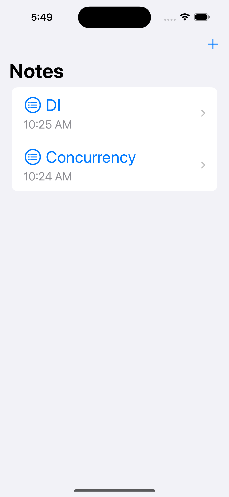
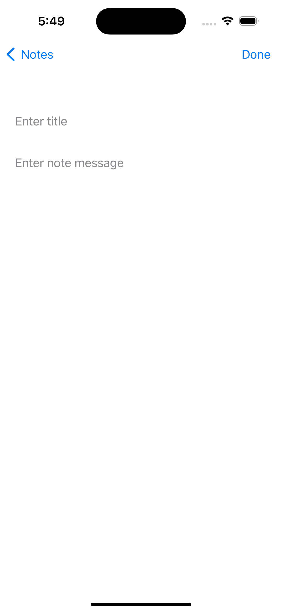

# NotesAppUsingUserDefaults
* Add, view and delete notes.
* Implemented using UserDefaults to guarantee data persistence after closing the App.
* Ulternativly check NotesAppUsingCoreData for CoreData implementation of this App https://github.com/AyaIrshaid/NotesAppUsingCoreData

## Using
* SwiftUI
* UserDefaults
* SwiftTesting

## Screenshots
  
